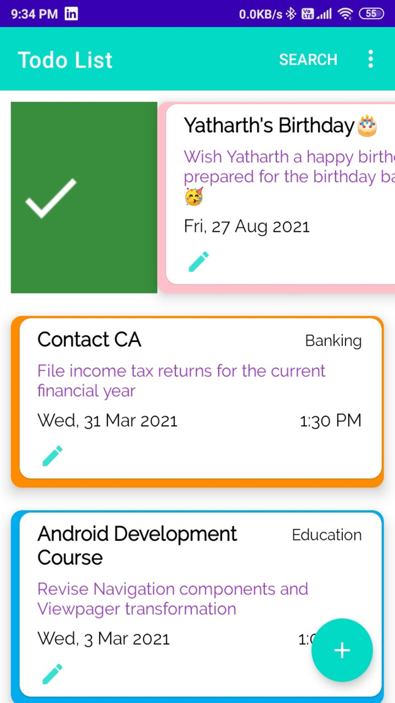
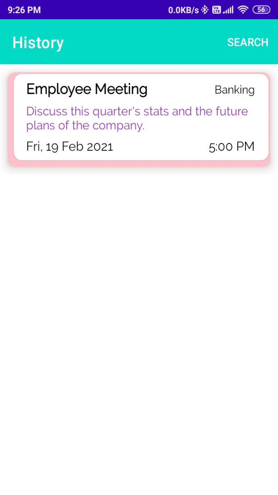
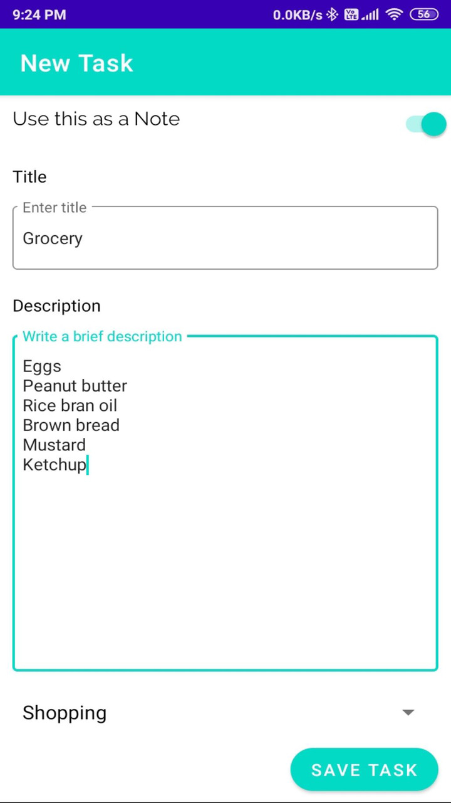
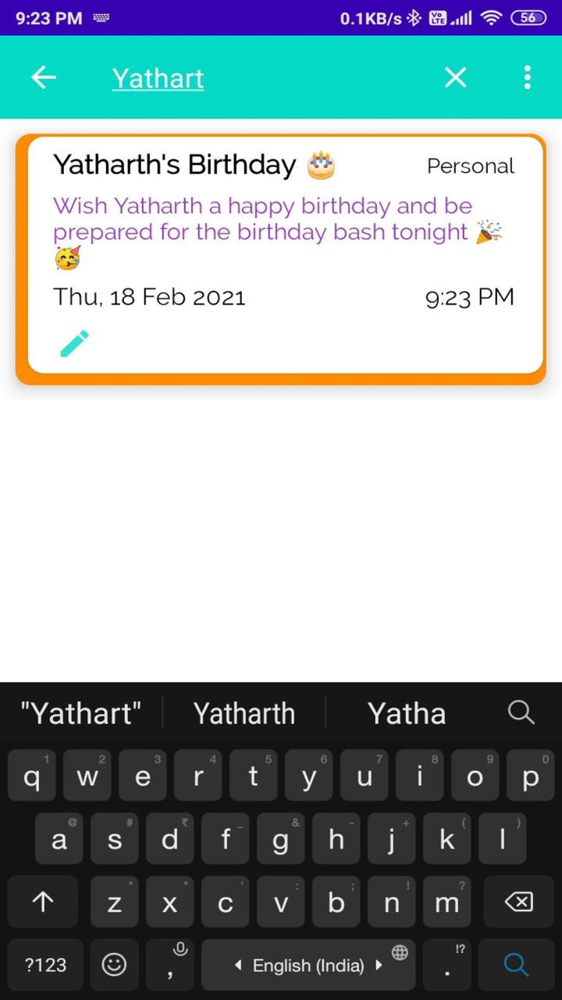
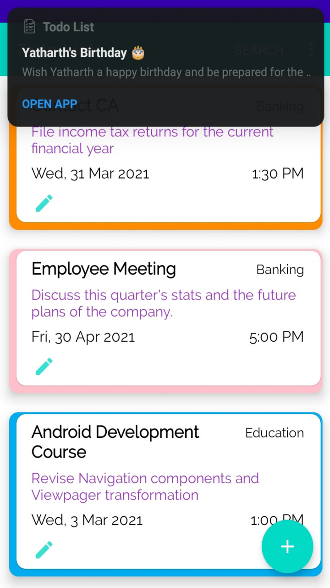
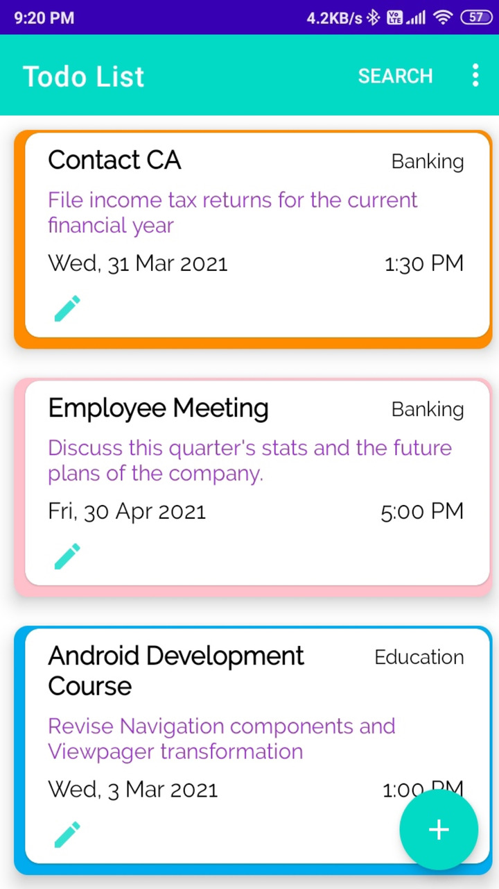
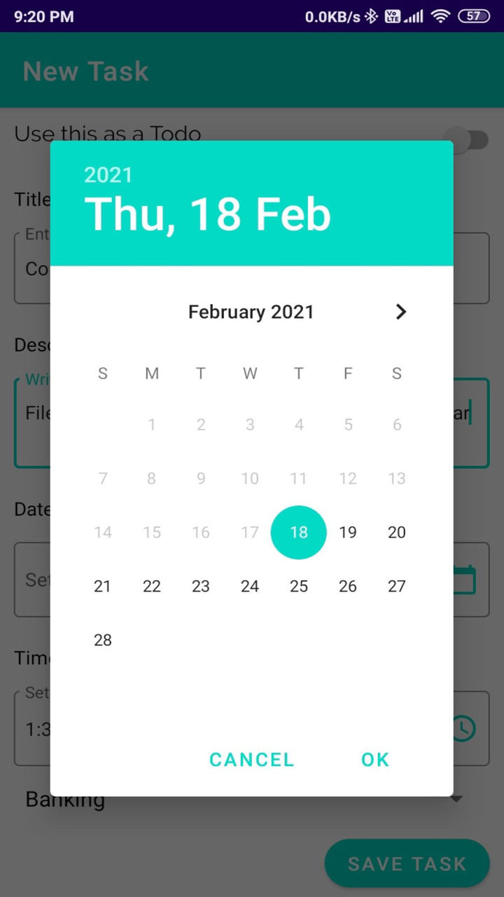
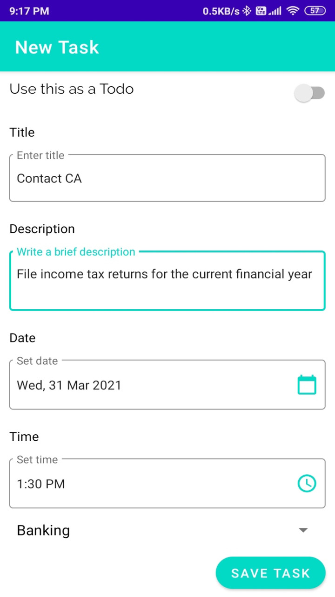

### Todo List
An app to make todos or small notes and notify the user on the set date and time.

#### _App Screenshots_
||||
|---|---|---|---|

|||||
|---|---|---|---|

#### _Libraries/Technology used_
- Room Database
- Live Data
- Alarm Manager
- Coroutines

#### _Published on_
- [Google Play Store](https://play.google.com/store/apps/details?id=com.acash.todolist "Show on Google Play")
- [Amazon App Store](https://www.amazon.in/Aakash-Gupta-Todo-List/dp/B08MBFPC7P/ref=sr_1_17?dchild=1&keywords=to+do+list+app&qid=1614203191&s=mobile-apps&sr=1-17 "Show on Amazon")
